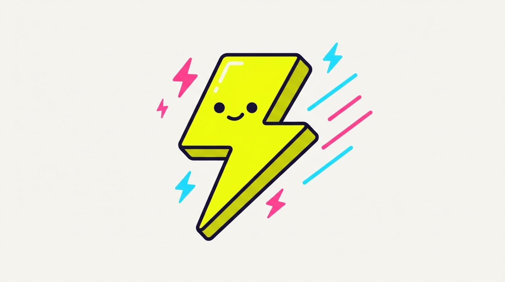
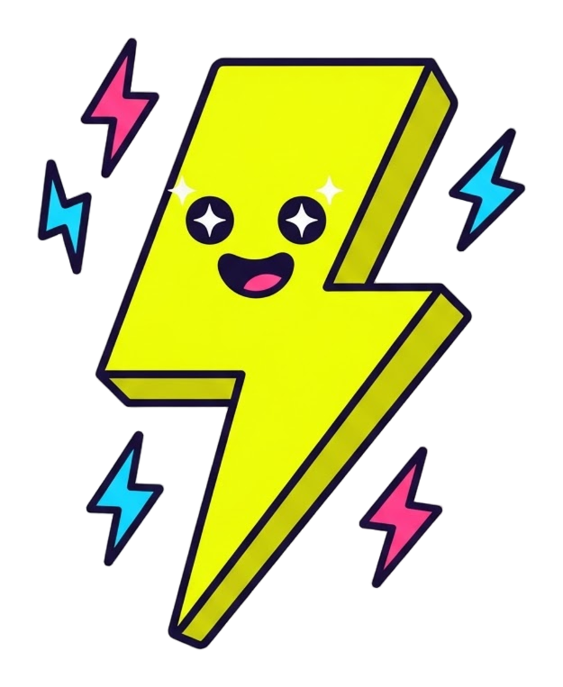
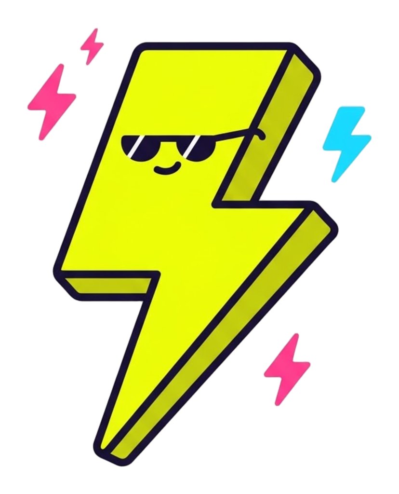
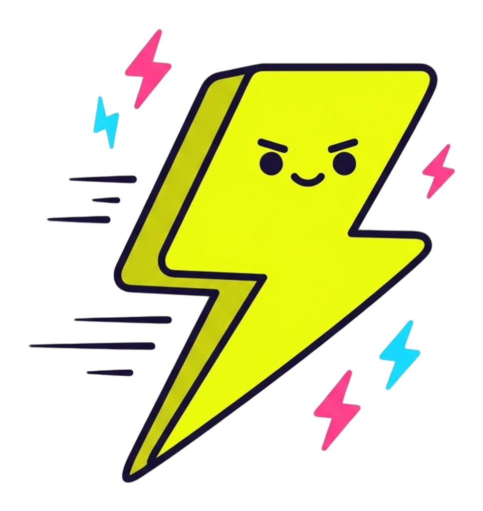

<p align="center">
  
</p>

<p align="center">
  
  &nbsp;
  
  &nbsp;
  
</p>

<h1 align="center">Zippy</h1>

<p align="center">
  <strong>Short links that open the native app, not the in-app browser.</strong><br>
  Open-source, serverless on Cloudflare, ~$0 to run.
</p>

<p align="center">
  <a href="./LICENSE"></a>
</p>

---

Zippy is a URL shortener whose links **open the native app** for platforms people
actually share — LinkedIn, Instagram, WhatsApp, Reddit, Product Hunt, YouTube,
TikTok, and X/Twitter — instead of trapping the visitor in an in-app webview. Tap
a Zippy link on a phone and it deep-links straight into the real app (with a clean
web fallback everywhere else); tap it on desktop and it's a plain fast redirect.
It's a single Cloudflare Worker backed by KV — no server, no database — and an
open-source take on urlgeni.us.

## How it works

`GET /:slug` looks the slug up in KV. If the destination belongs to a known
platform **and** the request is from a phone, Zippy serves a tiny interstitial
that launches the app (iOS custom scheme with a visibility-aware fallback;
Android `intent://`, which falls back natively). Otherwise it's a `301`. The whole
platform matcher — the core of the project — is one readable data table in
[`services/redirect/src/platforms.ts`](./services/redirect/src/platforms.ts);
adding or fixing a platform is a one-object PR.

## Quickstart

```bash
bun install
bun --filter @zippy/redirect dev     # wrangler dev → http://localhost:8787
bun --filter @zippy/redirect test    # vitest
```

Create a link (needs the `API_TOKEN` secret — see the service README):

```bash
curl -X POST http://localhost:8787/api/links \
  -H "authorization: Bearer $API_TOKEN" \
  -d '{"url":"https://x.com/nasa/status/123"}'
# → {"slug":"aB3xY9","shortUrl":"http://localhost:8787/aB3xY9","deeplink":"x"}
```

Deploying (KV namespace, `API_TOKEN` secret, and the `zipthe.link` custom domain)
is covered in **[`services/redirect/README.md`](./services/redirect/README.md)**.

## Repo layout

The core lives in one service; the repo keeps the builders-stack conventions
(Nx task graph, Oxlint/Oxfmt, Tilt dev dashboard) so it scales cleanly if a cloud
product grows on top.

```
services/redirect/   the Worker — routing, KV, deeplink table, interstitial, tests
api-collection/      Bruno requests for the API (links create / get)
docs/assets/         brand art (README hero + mascot stickers)
```

Zippy is AGPL-3.0 — a paid cloud product is planned on top, open-core style. If you
build on it, the AGPL terms apply.

## Built with builders-stack

Scaffolded from **[builders-stack](https://github.com/lonormaly/builders-stack)** —
the AI-native TypeScript monorepo starter — then gutted to this single service.
