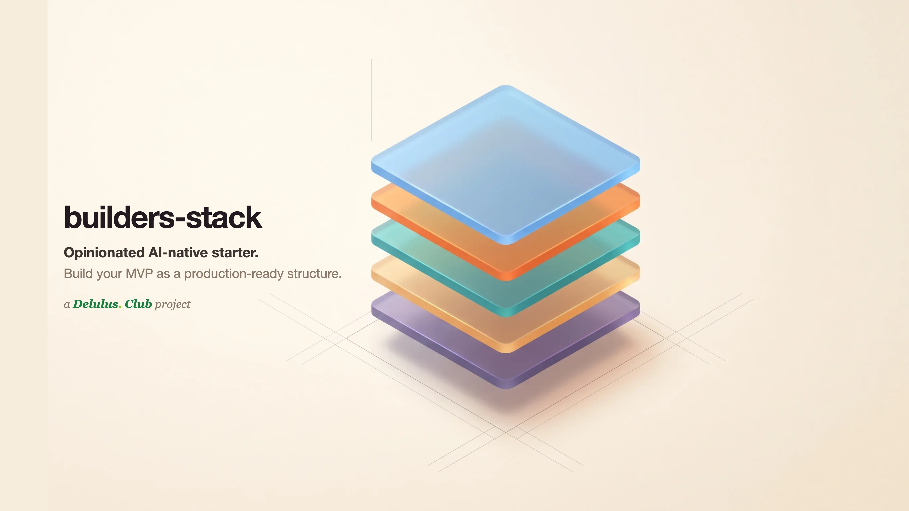
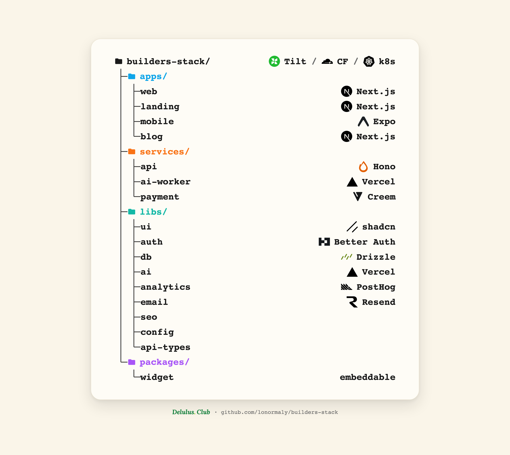

<p align="center">
  
</p>

<h1 align="center">builders-stack</h1>

<p align="center">
  <strong>The starter repo your AI agent can actually navigate.</strong><br>
  Opinionated AI-native starter. Build your MVP as a <em>production-ready</em> structure.
</p>

<p align="center">
  <a href="https://github.com/lonormaly/builders-stack/actions/workflows/ci.yml"></a>
  <a href="./LICENSE"></a>
  
  <a href="./CONTRIBUTING.md"></a>
  <a href="https://github.com/lonormaly/builders-stack/commits/main"></a>
</p>

<p align="center">
  <a href="./docs/stack/getting-started.md"><b>Getting Started</b></a> ·
  <a href="#the-map--five-buckets-defined-by-exposure"><b>Structure</b></a> ·
  <a href="./docs/stack/architecture.md"><b>Architecture</b></a> ·
  <a href="./docs/stack/free-stack.md"><b>Free Stack</b></a> ·
  <a href="./docs/stack/costs.md"><b>Costs</b></a> ·
  <a href="./docs/stack/migration.md"><b>Migration</b></a> ·
  <a href="./CONTRIBUTING.md"><b>Contributing</b></a>
</p>

---

**Four buckets for what the system _is_, one for how you _operate_ it — plus three laws the linter enforces.** Everything else is a deletable example.

- **What you RUN** — `apps/` (served to **humans**) · `services/` (served to **machines** — anything with a URL) · `libs/` (**shared**, never served).
- **What you SHIP** — `packages/` — distributables served to **third parties** (npm SDKs, embeddable widgets, CLIs): tagged `type:package`, depending on libs only, and **terminal** (nothing inside the repo imports them). Add it when you distribute something; delete it when you don't.
- **How you OPERATE it** — `ops/` — deploy · db · secrets · runbooks · local-CI. The **outermost** layer: it reaches _down_ to drive the code; nothing reaches back up into it. Not a workspace, invisible to Nx. See [`ops/`](./ops/).

Three laws — **no-upward-import** · **one-public-door** · **by-feature-not-layer**. Dependencies only ever point **down** (`apps` → `services` → `libs`); an arrow pointing up is the design smell the boundary rule rejects. The packages inside are real, working examples that prove the pattern end to end; keep the shape and [gut the examples you don't need](./docs/stack/make-it-yours.md). **The structure is the product** — and it's the map your coding agent navigates instead of re-guessing every session.

<!-- Optional second hero: a screenshot of the Tilt dashboard. Drop one at
     docs/assets/tilt-dashboard.png and uncomment the line below.
      -->

An opinionated, AI-native starter for 2026. Clone it, run one command, and you have a real project structure — `apps` / `services` / `libs`, a live-status dashboard, a design system, and a repo your coding agent can actually navigate.

> Part of **The Builder's Stack** by [Shai Snir](https://www.linkedin.com/in/shaisnir/) · [Delulus Club](https://www.delulus.club).

## Why this exists

Most of us skip "real" structure on a new project — _"it's just an MVP, we'll clean it up later."_ That's exactly where the most expensive, least-budgeted cost begins: the **restructure tax**, the week (sometimes the quarter) you later spend moving every file into the shape the project needed all along, while the roadmap waits.

In 2026 it isn't worth paying. Building it right on day one is the _fast_ path, not the slow one — you pay that cost once, up front, when it's nearly free, and then it **grows with you**: the same buckets carry a weekend prototype and a funded team, sized to your product's roles, not your traffic. The stack underneath is almost all **free tools** on tiers generous enough to grow with you, so a fresh clone runs at roughly **$0**. You ship real products faster, made right the first time. (That your coding agent can also read the structure cleanly instead of re-deriving it every session is one more payoff — not the reason.)

"One app" is a lie. The moment your project does anything real it already has **roles**: something users see, something with a URL, something shared between them. Name those roles and everything has a home. Don't, and it all rots into one folder nobody — human or agent — can navigate.

## Quickstart

```bash
npm install -g portless   # one-time: stable named URLs for every service (see docs/portless.md)
bun install
cp .env.example .env.local    # boots empty — every paid integration is env-gated to a no-op
./scripts/link-env.sh         # symlink root .env.local into each app/service (one source of truth)
cp agents/mcp.json .mcp.json  # optional: wire up your agent's MCP servers (context7, postgres, …)
./tilt_up.sh              # boots every app + service → dashboard at localhost:10380
```

Always `./tilt_up.sh`, **never `tilt up` directly** — the script pins a per-project Tilt UI port (10380), so you can run several Tilt projects at once without clashing on the shared default.

New here? **[`docs/stack/getting-started.md`](./docs/stack/getting-started.md)** is the turnkey "provide your keys" guide (what each integration is for, where to get the key, what runs without it). What it all costs: **[`docs/stack/costs.md`](./docs/stack/costs.md)** — ~$0/month at MVP scale.

Served roles get stable named URLs via [Portless](https://github.com/vercel-labs/portless) — no pinned ports, no collisions:

| Role      | URL                                                     |
| --------- | ------------------------------------------------------- |
| Web       | `http://web.stack.localhost:1355`                       |
| Landing   | `http://landing.stack.localhost:1355`                   |
| Blog      | `http://blog.stack.localhost:1355`                      |
| API       | `http://api.stack.localhost:1355` (`/health` · `/docs`) |
| Payment   | `http://payment.stack.localhost:1355`                   |
| Storybook | `http://storybook.stack.localhost:1355`                 |

See [`docs/portless.md`](./docs/portless.md) for the full convention.

## The map — five buckets, defined by exposure

Four buckets are **what the system _is_**; the fifth is **how you _operate_ it**.



| Bucket          | Role                                                                         | Served?                                |
| --------------- | ---------------------------------------------------------------------------- | -------------------------------------- |
| **`apps/`**     | what **humans** see (web, landing, mobile, **blog**)                         | public UI                              |
| **`services/`** | what has a **URL** (api, ai-worker, payment)                                 | served to other code                   |
| **`libs/`**     | **shared** code (ui, auth, db, ai, config, api-types, analytics, email, seo) | **never served** — consumed only       |
| **`packages/`** | what you **ship** — distributables (widget; npm SDKs, CLIs)                  | served to **third parties** — terminal |
| **`ops/`**      | how you **operate** it (deploy · db · secrets · runbooks · ci)               | not served — **drives** the rest       |

`apps`·`services`·`libs` are **what you RUN**; `packages/` is **what you SHIP** — a built artifact (`type:package`) that leaves the repo, depends on `libs/*` only, and that nothing internal imports; `ops/` is **how you OPERATE** it — the outermost layer that reaches _down_ to deploy/seed/provision the code while nothing reaches back up into it (it isn't a workspace, so Nx never sees it). See [`ops/README.md`](./ops/README.md).

The rest of the top level is **non-code siblings** — real folders, but not buckets and not in the build graph:

| Folder            | What                                                                  |
| ----------------- | --------------------------------------------------------------------- |
| `docs/`           | the written docs (incl. `docs/brand/` — brand soul + voice + roadmap) |
| `agents/`         | agent skills, subagents, MCP config (`cp agents/mcp.json .mcp.json`)  |
| `api-collection/` | version-controlled Bruno API requests                                 |
| `infra/`          | Dockerfiles · docker-compose · k8s manifests                          |
| `scripts/`        | `deploy.sh` · `link-env.sh` · `seed.sh` · `tunnel.sh`                 |

> **`infra/` and `scripts/` are operate-adjacent.** They do the same "how you operate it" job as `ops/` and are slated to consolidate under it in a follow-up. They're left in place for now (too many references to move safely in one pass); `ops/deploy` and `ops/db` already front them as the single entrypoint.

Two rules keep it honest (borrowed from Nx):

- **No upward import** — `libs` never import from `apps` or `services`. Dependencies point _down_.
- **One public door per lib** — each lib exposes a single `src/index.ts`; import from the package name (`@stack/ui`), never deep paths.

Inside each app/service, organize **by feature** (`billing/`, `users/`), not by layer (`controllers/`, `models/`). Folders should tell you what the thing _does_.

Migrating an existing project in → [`docs/stack/migration.md`](./docs/stack/migration.md).

## The runtime half — Tilt

Folders tell you _where things live_. The Tiltfile (**`.devops/Tiltfile`** — the root `Tiltfile` just `load_dynamic`s it, so edit the one in `.devops/`) tells you _what's running_. One `./tilt_up.sh` boots every role, shows live status + logs in one dashboard, and turns one-off flows (deploy, tunnel, `db push`) into click-buttons. It's also a machine-readable manifest your agent reads to know what exists and how to run it.

## Task orchestration — Nx

Tilt runs your **dev servers**. Nx runs your **tasks** — `build`, `typecheck`, `lint`, `test` — and it's the half that makes a growing monorepo stay fast. Two tools, two jobs, no overlap: **Tilt = what's running; Nx = the task graph, caching, affected, boundaries, and generators.** Dev servers are never routed through Nx — you still `./tilt_up.sh`.

What it buys you ([monorepo.tools](https://monorepo.tools) framing):

- **Cache** — every task result is cached by input hash, locally and (opt-in) across CI. Change one lib, only its dependents re-run.
- **Affected** — `bun run affected` (`nx affected`) runs tasks _only_ for the projects a change touched. PR CI runs what changed, nothing else.
- **`nx graph`** — the interactive dependency graph of the whole repo (`bun run graph`).
- **Enforced boundaries** — the two laws below become **lint errors**. Every project is tagged `type:app` / `type:service` / `type:lib`, and `@nx/enforce-module-boundaries` rejects a `lib` that imports an app, an app that imports another app, and deep imports past a lib's barrel. "Enforce it in review" → enforced in `lint`.
- **Generators** — `nx g @nx/js:lib …` scaffolds a new lib/service/app that's _already_ tagged, named `@stack/*`, and has its single `src/index.ts` door — it can't be born breaking the rules.

```bash
bun run check      # nx run-many -t typecheck lint — the pre-push gate
bun run graph      # open the project graph
bun run affected   # lint + typecheck + build, only what changed
```

Full guide, generator commands, and the caching/CI config: [`docs/nx.md`](./docs/nx.md).

## Lint & format — Oxlint + Oxfmt

**Oxlint + Oxfmt (Rust, ~30x faster) do the bulk of linting and formatting; ESLint is kept ONLY for `@nx/enforce-module-boundaries`** — the one rule Oxlint has no equivalent for. `eslint-plugin-oxlint` turns off every ESLint rule Oxlint already covers, so there's no double-reporting.

```bash
bun run lint            # oxlint — whole repo, type-aware
bun run format          # oxfmt — write
bun run format:check    # oxfmt — CI gate
bun run lint:boundaries # ESLint @nx/enforce-module-boundaries only
```

Full guide: [`docs/linting.md`](./docs/linting.md).

## It scales without moving

The **folders** are fixed from day one, even solo. Only the **packaging** grows: `bun run dev` → Tilt → Docker → k8s, as you need it. You never restructure — you just add infra under `infra/`.

## Almost free by design

The stack is chosen so a real product gets from idea to paying users at near-zero cost — Cloudflare, Neon, Better Auth, Resend, PostHog, Clarity, Infisical, Creem — and most tiers carry you well past MVP (100k Cloudflare requests/day, 1M PostHog events/month, Better Auth's **no per-MAU billing**, Clarity uncapped forever). Every integration is **env-gated**: no key → silent no-op, the app still boots — you add a card, not a rebuild, when a ceiling actually bites. (The one exception: AI tokens, paid from the first call.)

Why each tool, what it gives you, and the honest catches → [`docs/stack/free-stack.md`](./docs/stack/free-stack.md). Exact next-tier prices → [`docs/stack/costs.md`](./docs/stack/costs.md).

## What's real vs. a stub

Almost all of it is real — it boots and proves the pattern end to end. Only a couple of things are deliberately left as placeholders for your product code.

**Real (boots, proves the pattern):**

- `apps/web` — Next.js, renders `@stack/ui`, live Better Auth login, type-safe calls to the API.
- `apps/landing` — public marketing site: `@stack/ui` hero + sections, shared `<Analytics/>`, links to the app.
- `apps/mobile` — real Expo/React Native starter rendering the shared `@stack/ui` tokens on native.
- `apps/blog` — static MDX blog, the GEO showcase; passes the `check:seo` gate.
- `services/api` — Hono + OpenAPI; validates against `@stack/api-types`, mounts Better Auth, ships server analytics.
- `services/payment` — Creem + Dodo adapters (`PaymentProvider` + `resolveProvider`) + Mock provider + tests; boots keyless.
- `services/ai-worker` — background worker (no URL).
- `libs/ui` — shadcn components + shared tokens + Storybook.
- `libs/db` — Drizzle (Postgres).
- `libs/auth` — Better Auth, boot-verified end to end (sign-up → event + welcome email).
- `libs/config` — typed env: one Zod schema + cached `getEnv()`.
- `libs/api-types` — the shared API contract (Zod schemas + inferred types), consumed by the API _and_ the web app.
- `libs/analytics` — the `<Analytics/>` client provider **and** an isomorphic typed event catalog (`./events`) client and server share.
- `libs/email` — Resend + React Email: typed, previewable templates + `sendEmail()`.
- `libs/seo` — the one door for page metadata + JSON-LD + the AI-crawler robots allow-list; enforced by `check:seo`.
- `packages/widget` — the worked example of the **4th bucket** (what you _ship_): an embeddable feedback widget that self-mounts into any third-party page. Real vanilla-DOM code, two build outputs (IIFE `<script src>` + ESM for npm), `bun:test`-pinned core, `type:package` (libs-only, terminal). Delete it if you distribute nothing.
- the Tiltfile + Nx wiring + workspace plumbing.

Everything above is **env-gated**: no keys → silent no-op, apps still boot.

**Placeholder (your infra/config goes here):** `infra/` (deploy manifests).

## Analytics & email

Batteries-included, all **env-gated** (no keys → silent no-op, apps still boot):

- **Analytics** — PostHog (product analytics + session replay + error tracking, client _and_ server) and Microsoft Clarity. Client init is a single shared `@stack/analytics` `<Analytics/>` provider every app reuses; server capture is `posthog-node` in `services/api`. Cross-subdomain identity ties marketing-site visitors to signed-up users. See [`docs/stack/analytics.md`](./docs/stack/analytics.md).
- **Email** — Resend + React Email (`@stack/email`): typed, previewable templates and a `sendEmail()` sender. On sign-up, Better Auth fires a `user_signed_up` event + a welcome email — the seed for a PostHog-driven drip. See [`docs/stack/email.md`](./docs/stack/email.md).

## Guardrails — enforced, not suggested

The parts most starters punt on with _"we'll add it later"_ ship here as **gates that fail the build**, not docs that rot:

- **SEO/GEO enforced** — `@stack/seo` is the one door for page metadata; `check:seo` (in `bun run check` + CI) fails the build the moment a public page ships without metadata (or a public root goes `"use client"`), and the robots allow-list keeps AI crawlers welcome. → [`docs/writing-for-ai-search.md`](./docs/writing-for-ai-search.md)
- **Accessibility enforced** — Oxlint `jsx-a11y` (`correctness: error`) turns an a11y regression into a lint/CI failure, not a review nit.
- **Security / supply-chain** — secret scan (gitleaks) + dependency scan (Dependabot + osv-scanner) run in CI; third-party skills/MCPs go through the **vet-before-install** law + [`scripts/scan-skill.sh`](./scripts/scan-skill.sh) first-gate check before they touch your agent. → [`docs/stack/agent-skills.md`](./docs/stack/agent-skills.md)
- **Compliance-ready** — analytics stay dormant behind `<ConsentBanner/>` (`@stack/analytics`, GDPR default-off), with `/privacy` + data-rights endpoints wired. Readiness maps, not a report: SOC 2 Trust Service Criteria + a GDPR checklist. → [`docs/soc2-readiness.md`](./docs/soc2-readiness.md), [`docs/gdpr.md`](./docs/gdpr.md)
- **Swappable payments** — one `PaymentProvider` interface, Creem **and** Dodo adapters behind `resolveProvider`; changing provider is a one-file swap, not a rewrite. → [`docs/stack/payments.md`](./docs/stack/payments.md)
- **Monitoring** — Better Stack uptime checks point at the services' existing `/health` (no code), plus a public status page + on-call alerting; an env-gated in-app log drain (`@stack/observability`) ships uncaught errors to Better Stack Logs. → [`docs/monitoring.md`](./docs/monitoring.md)
- **A blog that's the GEO engine** — `apps/blog`, static MDX, is the worked showcase for writing pages an AI search index actually cites. → [`docs/writing-for-ai-search.md`](./docs/writing-for-ai-search.md)

## For your AI agent

Start at [`AGENTS.md`](./AGENTS.md) — the repo-root primer Codex, Cursor, and Copilot read by convention: the map of where everything lives and the conventions to follow (Claude Code also reads [`CLAUDE.md`](./CLAUDE.md)). The [`agents/`](./agents) folder is the deep dive: skills, subagents, and an MCP config (`cp agents/mcp.json .mcp.json`) so an agent can plug in and start building _inside the structure_ instead of fighting it.

Bringing in a third-party skill or MCP? **Vet it first** — it's code with your agent's permissions. [`docs/stack/agent-skills.md`](./docs/stack/agent-skills.md) is the "vet before you install" law + a curated, scan-gated recommended list; [`scripts/scan-skill.sh`](./scripts/scan-skill.sh) is the first-gate reputation check.

---

MIT. Steal it, ship faster.
