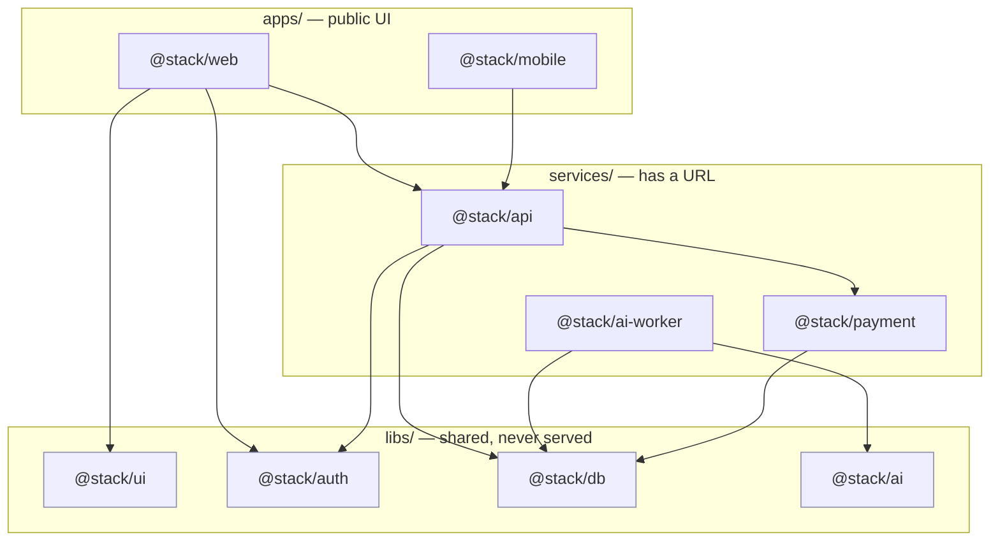

# Architecture

The whole system rests on one idea: **"one app" is a lie.** The moment a project does anything real it has _roles_ — something users see, something with a URL, something shared between them. Name the roles and everything has a home. Don't, and it rots into one folder nobody — human or agent — can navigate.

## The taxonomy — five buckets, defined by exposure

The sorting question is always the same: **is it served, and to whom?** Four buckets are **what the system _is_** (three you RUN + one you SHIP); a fifth, `ops/`, is **how you _operate_ it**.

| Folder      | Role                            | Served?                                | Lives here                                                                                       |
| ----------- | ------------------------------- | -------------------------------------- | ------------------------------------------------------------------------------------------------ |
| `apps/`     | what **humans** see             | public UI                              | `@stack/web` (Next.js), `@stack/mobile` (React Native)                                           |
| `services/` | what has a **URL** / own deploy | served to other code                   | `@stack/api` (Hono + OpenAPI), `@stack/ai-worker` (background), `@stack/payment` (Creem adapter) |
| `libs/`     | **shared** code                 | **never served** — consumed only       | `@stack/ui`, `@stack/auth`, `@stack/db`, `@stack/ai`                                             |
| `packages/` | what you **ship**               | served to **third parties** — terminal | `@stack/widget` (embeddable widget: IIFE + ESM); npm SDKs, CLIs                                  |
| `ops/`      | how you **operate** it          | not served — **drives** the rest       | `ops/deploy` · `ops/db` · `ops/secrets` (→ Ringtail) · `ops/runbooks` · `ops/ci`                 |

`apps`·`services`·`libs` are **what you RUN**; `packages/` is **what you SHIP** — a `type:package` distributable that depends on `libs/*` only and that nothing internal imports; `ops/` is **how you OPERATE** it — the outermost layer that reaches _down_ to deploy/seed/provision the code while **nothing imports _from_ it**. `ops/` is deliberately **not a workspace** and **invisible to Nx** (no build target, no boundary to break) — a non-code sibling like `docs/`, not a code peer. See [`../ops/README.md`](../../ops/README.md).

Those five are the entire top level that carries meaning. Every piece of **code** you build sorts into one of the four code buckets; if it doesn't fit, that's a signal to reconsider the design — not to invent a fifth _code_ bucket. Operate material (deploy, migrations, runbooks, secret provisioning) is not code — it belongs in `ops/`.

## The dependency direction

Dependencies point **down**. Apps depend on services and libs; services depend on libs; libs depend on nothing above them.



The arrows never point up. A `lib` reaching into an `app` is the design smell; if a lib "needs" something from an app, the boundary is misplaced and the dependency should be passed in instead.

## The two rules (borrowed from Nx)

Everything else is convention; these two are laws.

### 1. No upward import

`libs` never import from `apps` or `services`. This is what keeps libs reusable — a lib that imports an app can only ever live in _this_ app. Enforce it in review (the `reviewer` subagent checks it) and, if you want teeth, with an ESLint boundary rule.

```
apps      ─┐
services  ─┤─▶ libs      ✅  down is fine
libs      ─X─▶ apps/services   ❌  never
```

### 2. One public door per lib

Each lib exposes a single `src/index.ts`. Consumers import by **package name** (`@stack/db`), never a deep path (`@stack/db/src/schema/users`).

```
import { users } from "@stack/db";              ✅  the public door
import { users } from "@stack/db/src/schema";    ❌  reaching past it
```

The barrel file _is_ the contract. Anything not exported is private and refactorable without breaking consumers. Deep imports freeze your internals into everyone's dependency graph.

## Inside a package: by feature, not by layer

Within an app or service, group by **what it does**, not by technical layer.

```
services/api/src/
  billing/      ← everything billing: routes, logic, schema-usage
    routes.ts
    service.ts
  users/
    routes.ts
    service.ts
```

not

```
services/api/src/
  controllers/  ← a layer, tells you nothing about the domain
  models/
  services/
```

Feature folders tell you the domain at a glance and keep a change to "billing" in one place. Layer folders scatter every feature across four directories.

## The runtime half — Tilt

Folders say _where things live_. The `Tiltfile` says _what's running_. One `./tilt_up.sh` boots every role, streams status + logs into one dashboard (`localhost:10380`), and turns one-off flows (`deploy`, `tunnel`, `db push`) into click-buttons. It's also a **machine-readable manifest** your agent reads to know what exists and how to start it.

Always `./tilt_up.sh`, never `tilt up` directly — the script pins a per-project UI port so multiple Tilt projects coexist.

## It scales without moving

The **folders** are fixed from day one, even solo. Only the **packaging** grows as you need it:

```
bun run dev  →  Tilt  →  Docker (infra/*.Dockerfile)  →  docker-compose  →  Kubernetes (infra/k8s)
```

You never restructure the repo to scale — you add infrastructure under `infra/`. The taxonomy that fits a weekend project is the same one that fits the Series-A version.

## Observability

Error tracking ships through **PostHog** (`libs/analytics` — the same `<Analytics/>` provider that carries product analytics and session replay), a deliberate MVP choice to keep one vendor and zero extra setup; swap in Sentry or OpenTelemetry here when you outgrow it.
